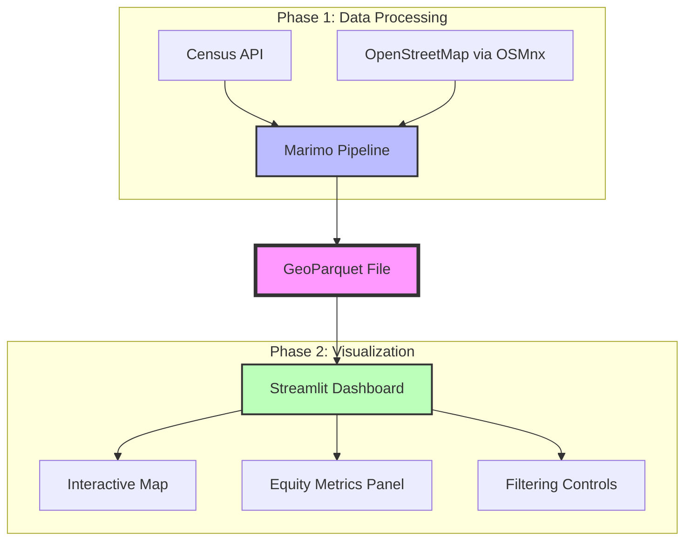
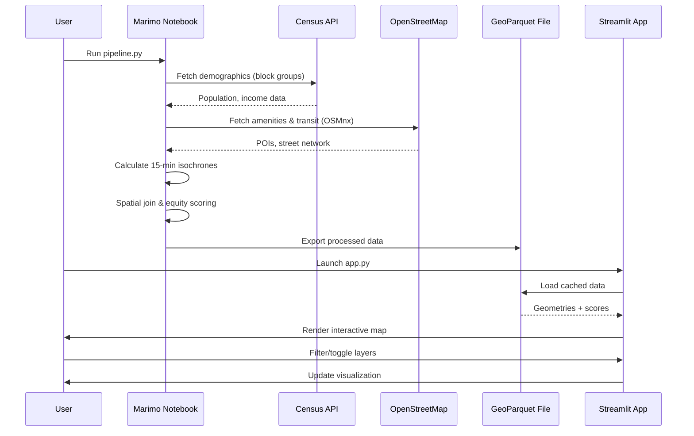

# Design Document: 15-Minute City & Transit Equity Analyzer

## Overview

The 15-Minute City & Transit Equity Analyzer is a geospatial portfolio project that evaluates urban accessibility and transit equity for specified urban areas. The system consists of two primary components: a data processing pipeline built with Marimo for heavy spatial computations, and a lightweight Streamlit dashboard for interactive visualization. The project analyzes whether residents can access essential amenities (grocery stores, healthcare, transit) within a 15-minute walk, and correlates this accessibility with demographic data to identify equity gaps.

The architecture is designed to be cost-effective and easily deployable, with all heavy processing done locally and the frontend consuming pre-processed GeoParquet files. This enables free hosting on Streamlit Cloud while maintaining rich geospatial analysis capabilities.

## Architecture



### Data Flow Sequence



## Components and Interfaces

### Component 1: Data Pipeline (Marimo Notebook)

**Purpose**: Performs heavy spatial processing to generate accessibility scores for Census block groups

**Interface**:
```python
# pipeline.py - Marimo notebook structure
class DataPipeline:
    def fetch_demographics(self, city_name: str, state: str) -> gpd.GeoDataFrame:
        """Fetch Census block group data with demographics"""
        pass
    
    def fetch_amenities(self, bbox: tuple) -> gpd.GeoDataFrame:
        """Fetch POIs (grocery, healthcare, transit) from OSM"""
        pass
    
    def fetch_street_network(self, bbox: tuple) -> nx.MultiDiGraph:
        """Download walkable street network using OSMnx"""
        pass
    
    def calculate_isochrones(
        self, 
        network: nx.MultiDiGraph, 
        amenities: gpd.GeoDataFrame,
        walk_time_minutes: int = 15
    ) -> gpd.GeoDataFrame:
        """Calculate 15-minute walking buffers around amenities"""
        pass
    
    def calculate_accessibility_scores(
        self,
        block_groups: gpd.GeoDataFrame,
        isochrones: gpd.GeoDataFrame
    ) -> gpd.GeoDataFrame:
        """Spatial join to compute accessibility score per block group"""
        pass
    
    def export_to_geoparquet(
        self,
        data: gpd.GeoDataFrame,
        output_path: str = "data/processed/processed_equity_data.parquet"
    ) -> None:
        """Export final dataset to GeoParquet format"""
        pass
```

**Responsibilities**:
- Fetch demographic data from Census API using cenpy
- Download amenities and street networks from OpenStreetMap via OSMnx
- Perform network analysis to calculate 15-minute walking isochrones
- Execute spatial joins between block groups and accessibility buffers
- Calculate composite accessibility scores
- Handle CRS transformations (WGS84 → local UTM → WGS84)
- Export processed data to GeoParquet format

**Key Dependencies**:
- `geopandas`: Spatial data manipulation
- `osmnx`: OpenStreetMap network analysis
- `cenpy`: Census data API wrapper
- `networkx`: Graph algorithms for network analysis
- `pyarrow`: GeoParquet file format support

### Component 2: Streamlit Dashboard

**Purpose**: Provides interactive visualization of accessibility and equity metrics

**Interface**:
```python
# app.py - Streamlit application
class EquityDashboard:
    @st.cache_data
    def load_data(self, file_path: str) -> gpd.GeoDataFrame:
        """Load GeoParquet file with caching"""
        pass
    
    def render_choropleth_map(
        self,
        data: gpd.GeoDataFrame,
        metric: str,
        colormap: str = "RdYlGn"
    ) -> folium.Map:
        """Render interactive choropleth map"""
        pass
    
    def calculate_equity_metrics(
        self,
        data: gpd.GeoDataFrame,
        income_threshold: float
    ) -> dict:
        """Calculate high-level equity KPIs"""
        pass
    
    def render_sidebar_controls(self) -> dict:
        """Render filtering and toggle controls"""
        pass
    
    def render_metrics_panel(self, metrics: dict) -> None:
        """Display equity metrics in sidebar or columns"""
        pass
```

**Responsibilities**:
- Load and cache GeoParquet data efficiently
- Render interactive choropleth maps using Folium or PyDeck
- Provide layer toggles (Accessibility Score vs. Median Income)
- Calculate and display equity KPIs
- Implement filtering controls (income thresholds, score ranges)
- Handle user interactions and map updates
- Maintain responsive UI for portfolio presentation

**Key Dependencies**:
- `streamlit`: Web application framework
- `streamlit-folium`: Folium integration for Streamlit
- `folium`: Interactive mapping library
- `geopandas`: Spatial data reading
- `pandas`: Data manipulation

## Data Models

### Model 1: CensusBlockGroup

```python
class CensusBlockGroup:
    """Represents a Census block group with demographics and geometry"""
    
    geoid: str                    # Unique Census identifier
    geometry: Polygon             # Block group boundary (WGS84)
    population: int               # Total population
    median_income: float          # Median household income ($)
    state: str                    # State FIPS code
    county: str                   # County FIPS code
    tract: str                    # Census tract code
    block_group: str              # Block group code
```

**Validation Rules**:
- `geoid` must be 12 characters (state + county + tract + block group)
- `geometry` must be a valid Polygon or MultiPolygon
- `population` must be non-negative integer
- `median_income` must be non-negative float
- All FIPS codes must match Census format

### Model 2: Amenity

```python
class Amenity:
    """Represents a point of interest from OpenStreetMap"""
    
    osm_id: int                   # OpenStreetMap ID
    geometry: Point               # Location (WGS84)
    amenity_type: str             # Category: grocery, healthcare, transit
    name: str                     # Amenity name (optional)
    tags: dict                    # Additional OSM tags
```

**Validation Rules**:
- `osm_id` must be unique positive integer
- `geometry` must be a valid Point
- `amenity_type` must be one of: ["grocery", "healthcare", "transit", "other"]
- `name` can be null/empty string

**OSM tag mapping** (see also DR-3.1.5 in requirements.md):

| `amenity_type` | OSM tags fetched |
|---|---|
| `grocery` | `amenity=supermarket`, `shop=supermarket`, `shop=grocery`, `shop=convenience` |
| `healthcare` | `amenity=hospital`, `amenity=clinic`, `amenity=doctors`, `amenity=pharmacy` |
| `transit` | `public_transport=stop_position`, `highway=bus_stop`, `railway=station`, `railway=halt` |
| `other` | `amenity=school`, `amenity=library`, `amenity=community_centre`, `leisure=park`, `amenity=place_of_worship` |

### Model 3: Isochrone

```python
class Isochrone:
    """Represents a 15-minute walking buffer around an amenity"""
    
    amenity_id: int               # Reference to source amenity
    geometry: Polygon             # 15-minute walking buffer (projected CRS)
    walk_time_minutes: int        # Travel time threshold (default: 15)
    amenity_type: str             # Category of source amenity
```

**Validation Rules**:
- `amenity_id` must reference valid Amenity
- `geometry` must be valid Polygon or MultiPolygon
- `walk_time_minutes` must be positive integer (typically 15)
- `amenity_type` must match source amenity category

### Model 4: ProcessedEquityData

```python
class ProcessedEquityData:
    """Final output model combining all spatial analysis results"""
    
    geoid: str                    # Census block group ID
    geometry: Polygon             # Block group boundary (WGS84)
    population: int               # Total population
    median_income: float          # Median household income ($)
    raw_score: float              # Capped weighted sum prior to normalization (for audit/monotonicity)
    accessibility_score: float    # Composite accessibility metric (0-100); normalize(raw_score)
    grocery_count: int            # Number of grocery stores within 15 min
    healthcare_count: int         # Number of healthcare facilities within 15 min
    transit_count: int            # Number of transit stops within 15 min
    other_count: int              # Number of other daily-need amenities within 15 min
    total_amenities: int          # Total amenities within 15 min (display/filter field)
    equity_category: str          # "High Access", "Medium Access", "Low Access"
```

**Validation Rules**:
- All fields from CensusBlockGroup must be valid
- `accessibility_score` must be in range [0, 100]
- All count fields must be non-negative integers
- `total_amenities` must equal sum of individual amenity counts
- `equity_category` must be one of: ["High Access", "Medium Access", "Low Access"]

**Equity Category Threshold Rationale, Configurability, and Validation**:

The default thresholds mapping `accessibility_score` → `equity_category` are:

| Score range | Category |
|---|---|
| ≥ 70 | High Access |
| 40 – 69 | Medium Access |
| < 40 | Low Access |

*Rationale*: These initial cut-points are inspired by common tertile/quartile splits used in urban equity literature (e.g., EPA EJScreen's percentile-based tiers and NACTO's access-shed guidance) and are designed so that, on a well-served city, roughly the top third of block groups fall in "High Access". They are **not** derived from a single authoritative standard and should be treated as a starting point, not a fixed rule.

*Configurability*: Thresholds must be configurable per city or dataset. They are exposed as a dedicated config block in `pipeline_config.yaml` (or equivalent environment variable overrides):

```yaml
equity_thresholds:
  high_access_min: 70   # block groups with score >= this value → "High Access"
  medium_access_min: 40 # block groups with score >= this value → "Medium Access"
                        # block groups below medium_access_min  → "Low Access"
```

The `assign_equity_category()` function reads these values at runtime so that analysts can recalibrate without code changes.

*Validation plan*: The following steps are now mandatory and automated (see FR-1.2.4 for full specification):
1. **Threshold bounds check** — enforced at pipeline startup; raises `ThresholdConfigError` if `high_access_min ≤ medium_access_min` or either is outside [0, 100].
2. **Percentile check** — each category must contain ≥ `min_category_fraction` (default 5 %) of block groups; result recorded as PASS/WARN in GeoParquet metadata.
3. **Sensitivity test** — re-assign with ±5-point threshold shifts; stability ≥ `sensitivity_stability_threshold` (default 90 %) required; result recorded as PASS/WARN in GeoParquet metadata.
4. **Stakeholder/ground-truth review** — optional manual step; overlay results against known under-served neighbourhoods and adjust thresholds if needed.
5. **Document the chosen values** — final thresholds, validation results, and timestamp are written to GeoParquet metadata under `equity_thresholds.*` keys and logged at INFO level.

**Accessibility Score Calculation** (canonical definition — see also [Accessibility Score Formula](#accessibility-score-formula) in Implementation Notes):

```
raw_score = (
    0.35 * min(grocery_count,    5)  +
    0.30 * min(healthcare_count, 3)  +
    0.25 * min(transit_count,   10)  +
    0.10 * min(other_count,      5)
)

accessibility_score = normalize(raw_score)
```

Where:
- `raw_score` is the **capped weighted sum prior to normalization**. It is stored as a separate output column for transparency and is the quantity used for all monotonicity checks (Property 2).
- `normalize(x)` scales the raw weighted sum to the **0–100** range using city-wide min–max normalization: `100 * (x − city_min) / (city_max − city_min)`.
- **Normalization edge-case**: when `city_max == city_min` (degenerate distribution — all block groups have the same raw score), set `accessibility_score = 50` for all records and log a WARNING. Do not divide by zero.
- `other_count` is the count of "other daily-need amenities" (schools, libraries, community centres, parks, places of worship — see Amenity OSM tag mapping above) reachable within 15 minutes.
- **Caps** (`min(count, cap)`) prevent a single block group with an unusually high amenity density from compressing the rest of the distribution. Cap values and their rationale:

  | Field | Cap | Rationale |
  |---|---|---|
  | `grocery_count` | 5 | ≥ 5 grocery stores within 15 min is effectively full coverage for any household |
  | `healthcare_count` | 3 | ≥ 3 clinics/hospitals represents robust healthcare access |
  | `transit_count` | 10 | ≥ 10 stops indicates dense transit coverage; additional stops add marginal value |
  | `other_count` | 5 | Mirrors grocery cap; prevents miscellaneous POIs from inflating scores |

- Weights (0.35 / 0.30 / 0.25 / 0.10) reflect the relative importance of amenity types for basic daily needs. They are configurable in `pipeline_config.yaml` under `scoring_weights`.
- Caps (5 / 3 / 10 / 5) are configurable in `pipeline_config.yaml` under `scoring_caps`.

## Correctness Properties

### Property 1: Spatial Integrity
**Statement**: For all block groups B and isochrones I, B is considered accessible to the amenity that generated I only when the overlap between B and I is substantial — specifically, when the intersection area exceeds a minimum coverage threshold. A bare boundary clip (e.g., a shared edge or a tiny corner overlap) does not constitute meaningful access.

**Rationale for area-threshold approach**: Using `intersects(block_group.geometry, isochrone.geometry)` alone is insufficient because a large or irregularly shaped block group can have its boundary clip an isochrone while the majority of its residents — and its centroid — lie well outside walking distance. Replacing the centroid check with an area-overlap threshold directly measures how much of the block group's population is plausibly within reach, which is the quantity that matters for equity analysis.

**Formal Expression**:
```
∀ block_group ∈ BlockGroups, ∀ isochrone ∈ Isochrones:
    area(intersection(block_group.geometry, isochrone.geometry))
        ≥ MIN_OVERLAP_FRACTION * area(block_group.geometry)
    ⟹
    block_group is counted as having access to isochrone.amenity
```

Where:
- `MIN_OVERLAP_FRACTION` is a configurable parameter (default: **0.10**, i.e., at least 10 % of the block group's area must fall inside the isochrone). It is exposed in `pipeline_config.yaml` under `spatial_join.min_overlap_fraction`.
- All area calculations are performed in the local UTM projection (metres²) to avoid distortion from geographic coordinates.
- Block groups where no isochrone meets the threshold contribute zero to their amenity counts and receive the lowest accessibility scores, which is the correct conservative outcome.

**Implementation note**: In GeoPandas this is computed after the spatial join as:
```python
joined["overlap_area"] = joined.geometry.intersection(isochrone_geom).area
joined["block_area"]   = joined.geometry.area
joined = joined[joined["overlap_area"] / joined["block_area"] >= MIN_OVERLAP_FRACTION]
```

### Property 2: Score Monotonicity
**Statement**: For all block groups, `accessibility_score` must increase monotonically with the **capped weighted sum** (`raw_score`) of accessible amenities. Monotonicity is defined over `raw_score`, not over `total_amenities`, because the `min()` caps in the scoring formula mean that adding amenities beyond a cap does not increase `raw_score` — and therefore should not be expected to increase `accessibility_score` either. This is intentional: the caps prevent outlier-dense block groups from compressing the rest of the distribution (see cap rationale in [Model 4: ProcessedEquityData](#model-4-processedequitydata)).

**Definitions**:
```
raw_score(b) =
    0.35 * min(b.grocery_count,    5)  +
    0.30 * min(b.healthcare_count, 3)  +
    0.25 * min(b.transit_count,   10)  +
    0.10 * min(b.other_count,      5)
```

**Formal Expression**:
```
∀ b1, b2 ∈ ProcessedEquityData:
    raw_score(b1) > raw_score(b2) ⟹
    b1.accessibility_score ≥ b2.accessibility_score
```

**Note on `total_amenities`**: `total_amenities` is a raw count field used for display and filtering; it is not the input to the scoring function and does not have a monotonic relationship with `accessibility_score` once any per-type cap is saturated. Tests and assertions must use `raw_score`, not `total_amenities`, when verifying this property.

### Property 3: CRS Consistency
**Statement**: All geometries in the final output must be in WGS84 (EPSG:4326) coordinate reference system.

**Formal Expression**:
```
∀ record ∈ ProcessedEquityData:
    record.geometry.crs == "EPSG:4326"
```

### Property 4: Data Completeness
**Statement**: Every block group in the target area must have a valid accessibility score and demographic data.

**Formal Expression**:
```
∀ block_group ∈ TargetArea:
    ∃ record ∈ ProcessedEquityData:
        record.geoid == block_group.geoid ∧
        record.accessibility_score ≠ null ∧
        record.median_income ≠ null ∧
        record.population > 0
```

### Property 5: Equity Category Consistency
**Statement**: Equity categories must be assigned consistently based on accessibility score thresholds. The thresholds themselves are configurable (see `equity_thresholds` in `pipeline_config.yaml`); the property holds for whatever values are configured.

**Formal Expression**:
```
∀ record ∈ ProcessedEquityData:
    (record.accessibility_score ≥ HIGH_MIN  ⟹ record.equity_category == "High Access") ∧
    (MED_MIN ≤ record.accessibility_score < HIGH_MIN ⟹ record.equity_category == "Medium Access") ∧
    (record.accessibility_score < MED_MIN   ⟹ record.equity_category == "Low Access")
```
Where `HIGH_MIN` and `MED_MIN` are read from `equity_thresholds` config (defaults: 70 and 40).

## Error Handling

### Error Scenario 1: Census API Failure

**Condition**: Census API is unavailable or returns invalid data
**Response**: 
- Log detailed error message with API endpoint and parameters
- Retry with exponential backoff (3 attempts)
- If all retries fail, raise `CensusAPIError` with actionable message
**Recovery**: 
- Provide fallback to cached Census data if available
- Document missing data in pipeline output log

### Error Scenario 2: OSM Network Download Failure

**Condition**: OSMnx cannot download street network for specified bounding box
**Response**:
- Check if bounding box is valid (coordinates in correct order)
- Verify network type parameter is valid
- Log error with specific OSM query details
- Raise `NetworkDownloadError`
**Recovery**:
- Suggest reducing bounding box size
- Provide option to use simplified network type
- Document affected area in output

### Error Scenario 3: CRS Transformation Error

**Condition**: Coordinate reference system transformation fails during spatial operations
**Response**:
- Validate source and target CRS definitions
- Check for geometries with invalid coordinates
- Log transformation parameters and error details
- Raise `CRSTransformationError`
**Recovery**:
- Attempt to repair invalid geometries using `buffer(0)` technique
- Fall back to alternative projection method
- Document affected geometries

### Error Scenario 4: Spatial Join Produces Empty Result

**Condition**: No block groups intersect with any isochrones
**Response**:
- Verify CRS alignment between datasets
- Check if isochrone generation succeeded
- Log summary statistics of both datasets
- Raise `EmptySpatialJoinError` with diagnostic info
**Recovery**:
- Suggest expanding isochrone buffer distance
- Verify bounding box encompasses target area
- Provide data validation report

### Error Scenario 5: GeoParquet File Not Found (Streamlit)

**Condition**: Streamlit app cannot locate processed data file
**Response**:
- Display user-friendly error message in app
- Provide instructions to run pipeline first
- Log file path that was attempted
**Recovery**:
- Check alternative file locations (relative paths)
- Provide clear setup instructions in UI
- Gracefully degrade to example data if available

### Error Scenario 6: Memory Overflow During Processing

**Condition**: Large city dataset exceeds available memory
**Response**:
- Monitor memory usage during processing
- Log memory consumption at each pipeline stage
- Raise `MemoryError` with current usage stats
**Recovery**:
- Implement chunked processing for large datasets
- Suggest reducing bounding box or simplifying geometries
- Provide memory optimization recommendations

## Testing Strategy

### Unit Testing Approach

**Test Coverage Goals**: 80% code coverage for pipeline and dashboard components

**Key Test Cases**:

1. **Data Fetching Tests**:
   - Test Census API integration with mock responses
   - Test OSMnx queries with sample bounding boxes
   - Verify error handling for API failures
   - Test data validation and cleaning functions

2. **Spatial Operations Tests**:
   - Test CRS transformations with known coordinate pairs
   - Test isochrone generation with sample networks
   - Test spatial join logic with synthetic geometries
   - Verify buffer calculations produce expected areas

3. **Scoring Algorithm Tests**:
   - Test accessibility score calculation with known inputs
   - Verify score normalization produces 0-100 range
   - Test equity category assignment logic
   - Verify weighted scoring formula

4. **Data Export Tests**:
   - Test GeoParquet write/read round-trip
   - Verify schema preservation
   - Test file compression and size
   - Verify CRS is preserved in output

5. **Dashboard Tests**:
   - Test data loading and caching
   - Test map rendering with sample data
   - Test filtering logic
   - Test metrics calculation

**Testing Framework**: pytest with pytest-cov for coverage reporting

### Property-Based Testing Approach

**Property Test Library**: Hypothesis (Python)

**Properties to Test**:

1. **Spatial Integrity Property**:
   - Generate random block groups and isochrones with known overlap fractions
   - Verify that only block groups where `overlap_area / block_area ≥ MIN_OVERLAP_FRACTION` are counted as having access
   - Test boundary cases: overlap exactly at threshold, just below threshold, and zero overlap
   - Test with various CRS projections (all area calculations must use UTM)

2. **Score Monotonicity Property**:
   - Generate random per-type amenity counts (`grocery_count`, `healthcare_count`, `transit_count`, `other_count`)
   - Compute `raw_score` using the capped weighted formula for each generated record
   - Verify that `raw_score(b1) > raw_score(b2)` implies `accessibility_score(b1) ≥ accessibility_score(b2)` after normalization
   - Test edge cases: all counts at zero, all counts at or above their caps (raw scores equal → scores equal), one type at cap while others vary
   - Do **not** assert monotonicity over `total_amenities` directly — counts beyond a cap do not increase `raw_score`

3. **CRS Consistency Property**:
   - Generate random geometries in various CRS
   - Transform through pipeline
   - Verify output is always WGS84

4. **Data Completeness Property**:
   - Generate random block group sets
   - Process through pipeline
   - Verify all records have required fields

5. **Idempotency Property**:
   - Process same input data multiple times
   - Verify outputs are identical
   - Test with various random seeds

**Hypothesis Strategies**:
```python
from hypothesis import given, strategies as st
from hypothesis.extra.geopandas import GeoDataFrames

@given(
    block_groups=GeoDataFrames(geometry_type="Polygon"),
    amenities=GeoDataFrames(geometry_type="Point")
)
def test_accessibility_score_monotonicity(block_groups, amenities):
    # Property test implementation
    pass
```

### Integration Testing Approach

**Integration Test Scenarios**:

1. **End-to-End Pipeline Test**:
   - Run complete pipeline on small test city
   - Verify GeoParquet output is created
   - Validate output schema and data quality
   - Check processing time is reasonable

2. **Pipeline-to-Dashboard Integration**:
   - Generate test GeoParquet file
   - Launch Streamlit app programmatically
   - Verify app loads data successfully
   - Test map rendering and interactions

3. **External API Integration**:
   - Test Census API with real requests (rate-limited)
   - Test OSMnx with real OSM data
   - Verify data quality and completeness
   - Test error handling with invalid inputs

4. **Cross-CRS Integration**:
   - Test pipeline with data in different CRS
   - Verify transformations are correct
   - Test with various UTM zones
   - Verify final output is always WGS84

**Testing Environment**: Docker container with all dependencies installed

## Performance Considerations

### Pipeline Performance

**Expected Processing Times** (for medium-sized city like Corona, CA):
- Census data fetch: 10-30 seconds
- OSM amenity fetch: 30-60 seconds
- Street network download: 60-120 seconds
- Isochrone calculation: 5-15 minutes (most expensive operation)
- Spatial join: 30-60 seconds
- GeoParquet export: 10-20 seconds
- **Total**: 10-20 minutes for complete pipeline

**Optimization Strategies**:
1. **Network Simplification**: Use `simplify=True` in OSMnx to reduce node count
2. **Parallel Processing**: Use `multiprocessing` for isochrone calculations across amenities
3. **Spatial Indexing**: Use R-tree spatial index for faster spatial joins
4. **Geometry Simplification**: Simplify block group geometries to reduce vertex count
5. **Caching**: Cache intermediate results (network, amenities) for iterative development

**Memory Requirements**:
- Small city (< 100k population): 2-4 GB RAM
- Medium city (100k-500k): 4-8 GB RAM
- Large city (> 500k): 8-16 GB RAM

### Dashboard Performance

**Load Time Goals**:
- Initial data load: < 2 seconds (with caching)
- Map render: < 1 second
- Filter update: < 500ms
- Layer toggle: < 300ms

**Optimization Strategies**:
1. **Data Caching**: Use `@st.cache_data` decorator for GeoParquet loading
2. **Geometry Simplification**: Simplify geometries for web display (tolerance=0.0001)
3. **Lazy Loading**: Load map tiles on-demand
4. **Efficient Serialization**: Use GeoParquet's columnar format for fast reads
5. **Client-Side Rendering**: Use Folium/PyDeck for client-side map rendering

**File Size Targets**:
- GeoParquet file: < 50 MB (for Streamlit Cloud free tier)
- Simplified geometries: 50-70% size reduction from original
- Compression: Use snappy compression in GeoParquet

## Security Considerations

### Data Privacy

**Census Data**: 
- All Census data is aggregated at block group level (no individual records)
- No personally identifiable information (PII) is collected or stored
- Data is publicly available from Census Bureau

**OpenStreetMap Data**:
- OSM data is publicly available and licensed under ODbL
- No user-generated content is collected
- Attribution required in dashboard footer

### API Security

**Census API**:
- Use API key if available (optional for public data)
- Implement rate limiting (max 500 requests/day)
- No authentication required for public endpoints

**OSMnx/Overpass API**:
- Respect Overpass API usage policy
- Implement request throttling (1 request/second)
- Cache results to minimize API calls

### Deployment Security

**Streamlit Cloud**:
- No sensitive data stored in repository
- GeoParquet file contains only public data
- No authentication required (public portfolio project)
- HTTPS enabled by default on Streamlit Cloud

**Environment Variables**:
- Store Census API key in `.env` file (if used)
- Add `.env` to `.gitignore`
- Use `python-dotenv` for local development

### Input Validation

**User Inputs** (if extended to allow custom cities):
- Validate city names against known list
- Sanitize bounding box coordinates
- Limit bounding box size to prevent abuse
- Validate income threshold ranges in dashboard

## Dependencies

### Core Dependencies

**Data Processing (Marimo Pipeline)**:
- `python>=3.9`: Core language
- `geopandas>=0.13.0`: Spatial data manipulation
- `osmnx>=1.6.0`: OpenStreetMap network analysis
- `cenpy>=1.0.1`: Census API wrapper
- `networkx>=3.1`: Graph algorithms
- `pyarrow>=12.0.0`: GeoParquet support
- `marimo>=0.1.0`: Notebook environment
- `shapely>=2.0.0`: Geometric operations
- `rtree>=1.0.0`: Spatial indexing

**Visualization (Streamlit Dashboard)**:
- `streamlit>=1.28.0`: Web application framework
- `streamlit-folium>=0.15.0`: Folium integration
- `folium>=0.15.0`: Interactive mapping
- `geopandas>=0.13.0`: Spatial data reading
- `pandas>=2.0.0`: Data manipulation
- `matplotlib>=3.7.0`: Static plotting (for metrics)
- `plotly>=5.17.0`: Interactive charts (optional)

### Development Dependencies

- `pytest>=7.4.0`: Testing framework
- `pytest-cov>=4.1.0`: Coverage reporting
- `hypothesis>=6.88.0`: Property-based testing
- `black>=23.9.0`: Code formatting
- `mypy>=1.5.0`: Type checking
- `ruff>=0.0.290`: Linting

### System Dependencies

- `libspatialindex`: Required for rtree (spatial indexing)
- `gdal`: Geospatial data abstraction library (optional, for advanced formats)

### External Services

- **Census Bureau API**: https://api.census.gov/data
  - No authentication required for basic usage
  - Optional API key for higher rate limits
  
- **Overpass API** (via OSMnx): https://overpass-api.de/api/
  - Public service for OpenStreetMap queries
  - Rate limited to 1 request/second
  
- **Streamlit Cloud**: https://streamlit.io/cloud
  - Free tier: 1 GB RAM, 1 CPU
  - Public apps only (no authentication)

### License Compliance

- **OpenStreetMap Data**: Open Database License (ODbL)
  - Requires attribution in application
  - Share-alike for derived databases
  
- **Census Data**: Public domain (US Government work)
  - No restrictions on use
  
- **Python Libraries**: Various open-source licenses (MIT, BSD, Apache 2.0)
  - All compatible with commercial and non-commercial use

## Implementation Notes

### CRS Transformation Workflow

The pipeline must handle three coordinate reference systems:

1. **WGS84 (EPSG:4326)**: Input/output CRS for all data
   - Census data is in WGS84
   - OSM data is in WGS84
   - Final output must be WGS84

2. **Local UTM Zone**: For accurate distance and area calculations
   - Determine UTM zone deterministically from the bounding box centroid using `geopandas.estimate_utm_crs(latitude, longitude)`
   - Transform to UTM for isochrone generation and area-overlap calculations (FR-1.2.2)
   - Use metres for walk distance and area calculations

3. **Web Mercator (EPSG:3857)**: For web map display (handled by Folium)

**Transformation Sequence**:
```
WGS84 → UTM (for analysis) → WGS84 (for output) → Web Mercator (for display)
```

### Isochrone Generation Algorithm

The 15-minute walking isochrone is calculated using network analysis:

1. Download street network with `network_type='walk'`
2. For each amenity point:
   - Find nearest network node
   - Calculate shortest paths to all nodes within 15-minute walk
   - Use walking speed: 4.5 km/h as the default [\[1\]](#ref-1) — this sits in the middle of the empirically observed range of **4.0–5.5 km/h** for adults in urban environments. Override this value for analyses targeting elderly populations (~3.0–3.5 km/h), children, or hilly terrain where effective speed is lower.
   - Generate convex hull or alpha shape around reachable nodes
3. Union overlapping isochrones by amenity type

### Accessibility Score Formula

The canonical formula is defined in [Model 4: ProcessedEquityData](#model-4-processedequitydata) above. Reproduced here for implementation reference:

```
raw_score = (
    0.35 * min(grocery_count,    5)  +
    0.30 * min(healthcare_count, 3)  +
    0.25 * min(transit_count,   10)  +
    0.10 * min(other_count,      5)
)

accessibility_score = normalize(raw_score)
```

Where `normalize(x) = 100 * (x − city_min) / (city_max − city_min)` applied across all block groups in the dataset. `raw_score` is stored as a separate GeoParquet column. Caps, weight rationale, configurability, and the normalization edge-case are documented in the model definition above.

### Streamlit Deployment Checklist

For successful deployment to Streamlit Cloud:

1. **Repository Structure**:
   - `app.py` in root directory
   - `requirements.txt` with pinned versions
   - `data/processed/processed_equity_data.parquet` committed to repo
   - `.streamlit/config.toml` for theme customization

2. **File Size Optimization**:
   - Simplify geometries to reduce file size
   - Use GeoParquet compression (snappy)
   - Target < 50 MB for free tier

3. **Configuration**:
   - Set `server.maxUploadSize` in config.toml
   - Configure theme colors for professional appearance
   - Add OpenStreetMap attribution in footer

4. **Testing**:
   - Test locally with `streamlit run app.py`
   - Verify data loads correctly
   - Test all interactive features
   - Check mobile responsiveness

## References

<a name="ref-1"></a>**[1]** Bohannon, R. W. (1997). "Comfortable and maximum walking speed of adults aged 20–79 years: reference values and determinants." *Age and Ageing*, 26(1), 15–19. <https://doi.org/10.1093/ageing/26.1.15>

This study, widely cited in urban planning and transport research, reports mean comfortable walking speeds of approximately 4.5–5.0 km/h for healthy adults. The broader literature (including WHO pedestrian safety guidelines and NACTO urban street design guides) consistently places typical urban pedestrian speeds in the **4.0–5.5 km/h** range. A default of **4.5 km/h** is therefore a conservative, inclusive choice that slightly favours slower walkers. Implementers should expose this as a configurable parameter (`walk_speed_kmh`) so analyses can be re-run for specific demographic contexts (e.g., senior-focused equity studies) or steep terrain where effective walking speed is reduced.
