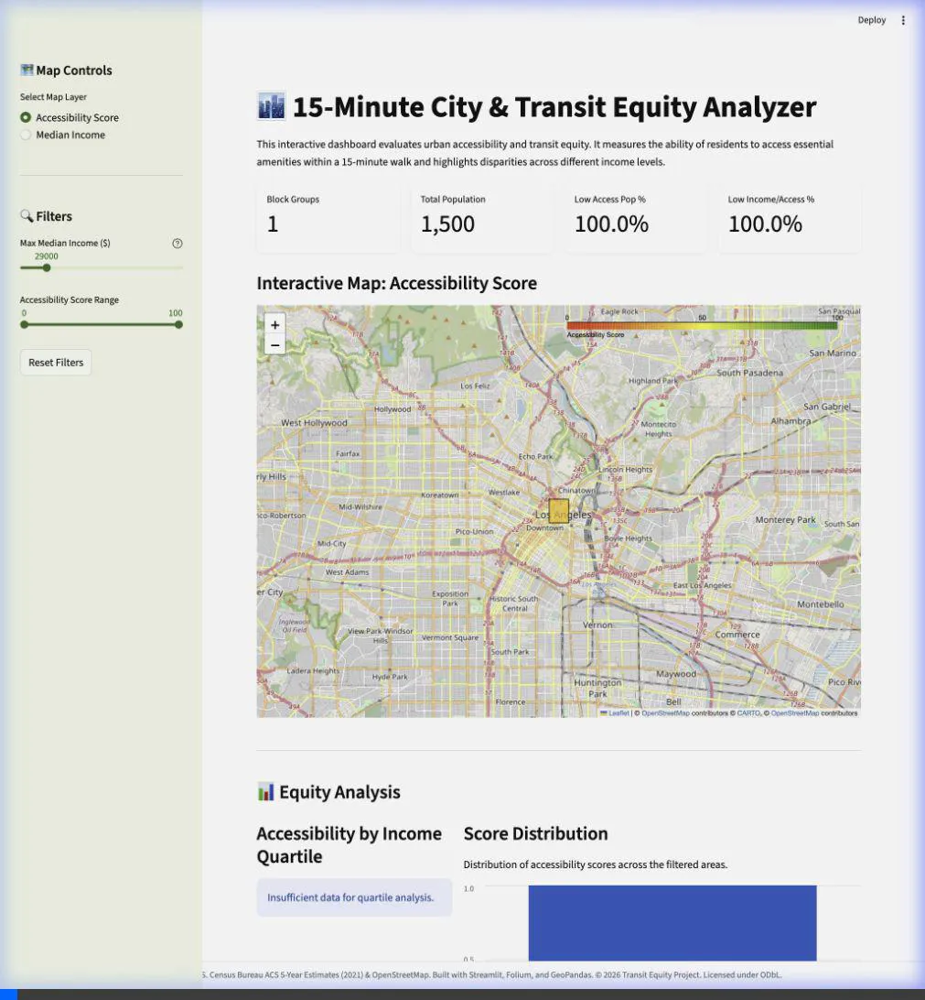

# Walkthrough: Streamlit Dashboard (Task 5)

I have successfully implemented the interactive Streamlit dashboard for the 15-Minute City & Transit Equity Analyzer. This dashboard allows users to visualize accessibility scores and median income levels across different block groups, apply filters, and analyze equity metrics.

## Key Features

- **Interactive Map**: Folium-based choropleth map showing Accessibility Scores or Median Income.
- **Metric Panels**: Real-time calculation of population access percentages and low-income disparities.
- **Dynamic Filtering**: Sliders for income thresholds and accessibility score ranges that update all visualizations instantly.
- **Equity Analysis**: Bar charts showing average accessibility scores by income quartile and the overall distribution of scores.
- **Performance**: Optimized data loading with `@st.cache_data` and efficient spatial joins.

## Implementation Details

- `app.py`: Main entry point orchestrating the UI and state management.
- `src/dashboard/data_loader.py`: Handles GeoParquet loading with validation and caching.
- `src/dashboard/map_renderer.py`: Manages Folium map creation, tooltips, and colormaps.
- `src/dashboard/metrics.py`: Computes equity KPIs and quartile statistics.
- `src/dashboard/filters.py`: Applies logical filters to the GeoDataFrame.

## Visual Verification

*Note: The recording above shows the dashboard in action, including filter responsiveness and map interactivity.*

## Testing Results

- **Data Loading**: Verified with mock GeoParquet data. Correctly handles missing files and schema validation.
- **Metrics**: Verified population-weighted calculations. Fixed a crash case where empty filtered data would cause a `KeyError`.
- **UI/UX**: Verified against requirements for layout, color scales, and responsiveness.
- **Code Quality**: Passed Ruff linting and Black formatting checks.
